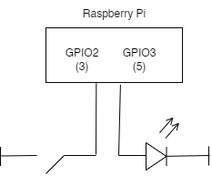

# Raspberry Pi Workshop

This repository is for a Raspberry Pi workshop to control an LED via GPIO pins as well as through HTTP, TCP, and UDP. The GPIO programming is done with node.js using the [`rpi-gpio` library](https://github.com/JamesBarwell/rpi-gpio.js).

## Setup
* Please setup your Raspberry Pi via the [Raspberry Pi Imager](https://www.raspberrypi.com/software/). 
* Install node.js using [nvm](https://github.com/nvm-sh/nvm)
* Install `git`
* Clone repository to Raspberry Pi
* Install modules with `npm install`

### Circuit
Connect an LED and switch to the Raspberry Pi with the following circuit:  

## Run
* Run `node button` to control LED via switch
* Run `node tcpServer` to start TCP server and control LED by connecting via TCP
* Run `node udpServer` to start UDP server and control LED by sending UDP packet
* Run `node webApp` to start express server and control LED with a web browser:
  * [http://raspberrypihost:8000/on](http://raspberrypi:8000/on) will turn on LED
  * [http://raspberrypihost:8000/off](http://raspberrypi:8000/off) will turn off LED
  * [http://raspberrypihost:8000/](http://raspberrypi:8000/) will toggle LED
* Run `node p5Server` to start server and visit [http://rapsberrypihost:8000](http://raspberrypi:8000) to control LED via a p5 server

### Arduino Client
A simple Arduino client is found [here](client/). 