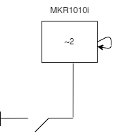

# Arduino UDP Client
You must first flash [udpButtonClient.ino](udpButtonClient.ino) to an Arduino with WiFi capabilities, eg MKR1010.   * Wire a simple switch from ground to digital pin 2
* Include a [header file](https://forum.arduino.cc/t/can-i-include-a-header-file-that-is-not-a-library/37468/2) with the same network as the Raspberry Pi server
* Replace the IP address and Port in `udpButtonClient.ino` with the Raspberry Pi server info
* Run the `udpServer` program on the Raspberry Pi

## Circuit

### Notes
Additional Arduino WiFi examples can be found [here](https://github.com/tigoe/Wifi_examples/tree/main).